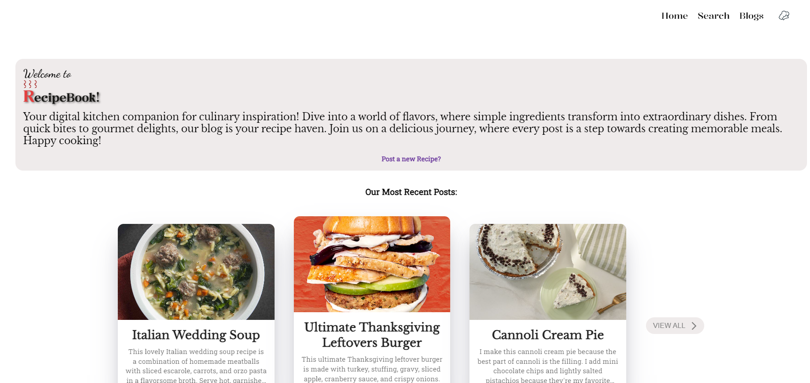
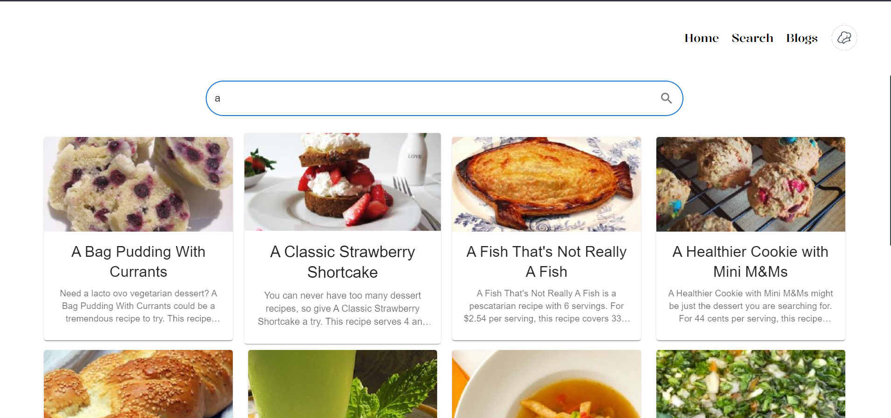
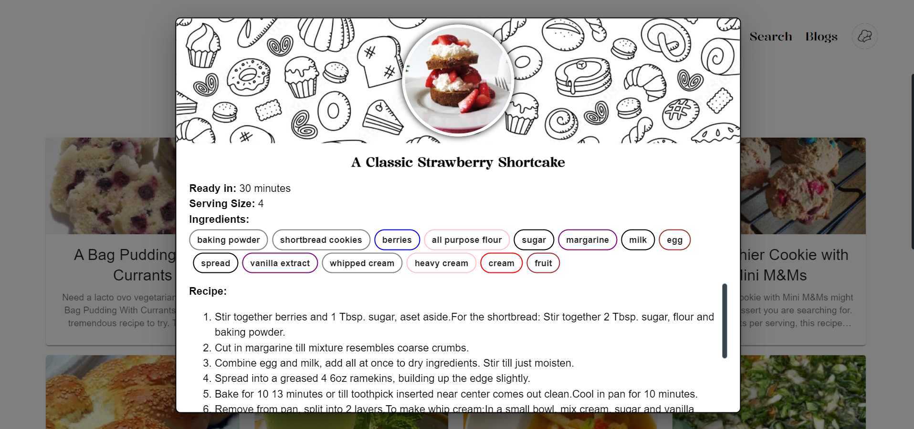
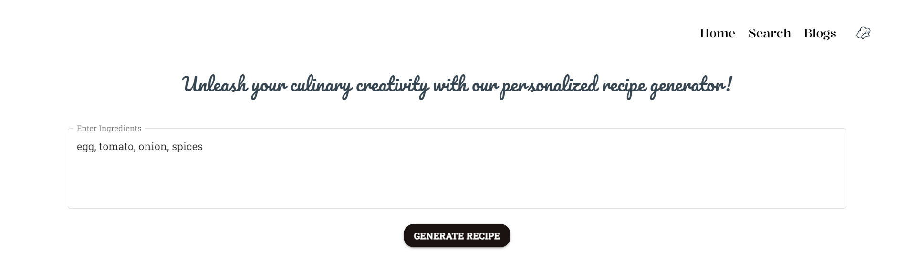
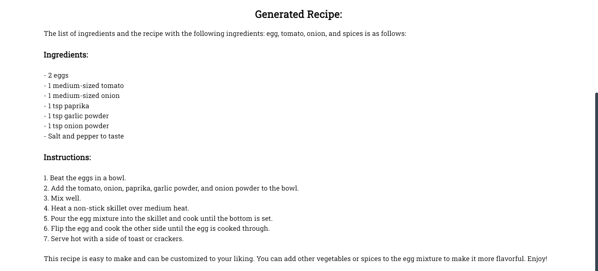

# RecipeBook


RecipeBook is a collaborative web application designed for sharing, exploring, and discovering a diverse array of recipes. Leveraging the power of the MERN stack (MongoDB, Express.js, React, Node.js), RecipeBook allows users to contribute their culinary creations, search through a curated collection of recipes, and receive personalized suggestions based on available ingredients using the "TinyLlama-1.1B-Chat-v1.0" model through the Hugging Face Inference API.

## Features

1. **Recipe Sharing:**

   <br>
   - Share your favorite recipes seamlessly with the RecipeBook community.
   - Streamlined user interface for effortless recipe submission.

2. **Recipe Search:**
   
   
   <br>
   - Explore an extensive collection of pre-made recipes available on the platform.
   - Effortlessly search for recipes based on keywords, categories, or specific ingredients.

3. **Ingredient-Based Recipe Suggestions:**
   
    
    <br>
   - Input your available kitchen ingredients.
   - Leverage the "TinyLlama-1.1B-Chat-v1.0" model via the Hugging Face Inference API to receive personalized recipe suggestions.

4. **Modern Technology Stack:**
   
   - Frontend developed with React for a dynamic and responsive user interface.
   - Backend powered by Node.js and Express.js, utilizing MongoDB for efficient data storage.
   - GraphQL employed for flexible and optimized database queries.

## Getting Started

To run RecipeBook locally, follow these steps:

1. Clone the repository:

   ```bash
   git clone https://github.com/Omega08/RecipeBook.git
   
2. Navigate to the project directory:

   ```bash
    cd RecipeBook
   
3. Install dependencies for both frontend and backend:
   - For Frontend:
    ```bash
    cd frontend && npm install
    ```

   - For Backend:
    ```bash
    cd frontend && npm install
    ```

4. Start the application:
   - For Frontend:
    ```bash
    cd frontend && npm start
    ```
   - For Backend:
    ```bash
    cd backend && npm start
    ```

## Contributing

Contributions are welcome! If you have any ideas for improvements, feature requests, or bug reports, please open an issue or submit a pull request.
